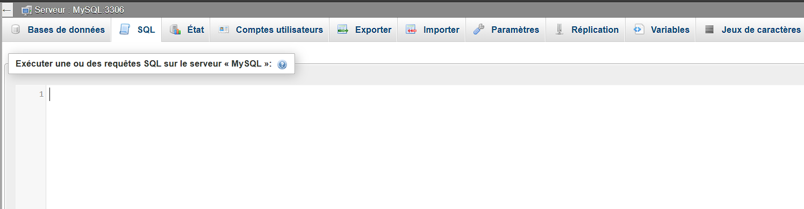
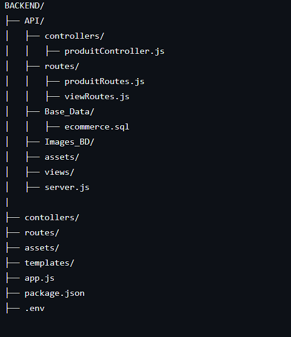

### WETHEFOOT - Boutique en ligne de vente de maillots

## Introduction
👋 Hello,
WETHEFOOT est une boutique en ligne de vente de maillots de football. Ce projet comporte deux serveurs principaux : un serveur pour l'API et un serveur pour le backend. Ce guide vous expliquera comment configurer et lancer ces deux serveurs.

## Prérequis

- Node.js (version 14 ou ultérieure)
- MySQL
- npm (gestionnaire de paquets Node.js)

## Installation

### Étape 1: Cloner le dépôt

Cloner le dépôt de notre projet WETHEFOOT:
git clone https://github.com/harelmarin/Sabrina_Marin
et indiquer le dossier dans lequel depot sera cloné.

### Étape 2: Installer les dépendances
La liste des installations nécessaires sont situés dans le fichier project.install

### Étape 3: Configuration de l'environnement

Créer un fichier .env à la racine du dossier BACKEND  et y ajouter les configurations situées dans le fichier env.example :

### Étape 4: Configuration de la base de données

Assurez-vous d'avoir MySQL installé et configuré sur votre machine.

Créez une base de données  en copiant le script situé dans le fichier ecommerce.sql (voir l'arborecence des fichiers définis plus bas ) et en l'excutant dans votre espace 

### Étape 5: Lancer les serveurs
Ouvrir 2 terminaux 

1er terminal Pour le serveur API :
- cd ../backend
- cd api
- node server.js

2eme terminal Pour le serveur backend :
- cd ../backend
- puis npm start 

### Étape 5: Ouvrir la page d'acceuil de la boutique
Ouvrir un navigateur et accéder à l'adresse : 
### http://localhost:8000/backend/home

## STRUCTURE DES FICHIERS DU DOSSIER BACKEND

## Utilisation

- *API Server*: Le serveur API est accessible via le port spécifié dans votre fichier .env (par défaut, 3000). 
Les endpoints principaux sont /api/produits pour les produits et / pour les vues.

- *Backend Server*: Le serveur backend est accessible via le port 8000. Les endpoints principaux sont /backend pour le back-office.

## Conclusion

Le projet WETHEFOOT est maintenant configuré et prêt à être utilisé.
